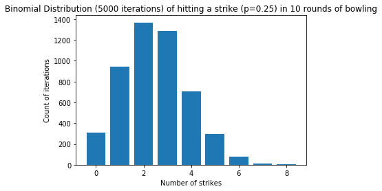

# Bernoulli and Binomial Distribution - Lab

## Introduction
In this lab, you'll practice your newly gained knowledge on the Bernoulli and Binomial Distribution.

## Objectives
You will be able to:
* Apply the formulas for the Binomial and Bernoulli distribution
* Apply NumPy to randomly generate Binomial and Bernoulli trials
* Use Matplotlib to generate Binomial and Bernoulli trials with various probabilities

## Apply the formulas for the Binomial and Bernoulli distribution

When playing a game of bowling, what is the probability of throwing exactly 3 strikes in a game with 10 rounds? Assume that the probability of throwing a strike is 25% for each round. Use the formula for the Binomial distribution to get to the answer. You've created this before, so we provide you with the function for factorials again:


```python
def factorial(n):
    prod = 1
    while n >= 1:
        prod = prod * n
        n = n - 1
    return prod
```


```python
p_3_strikes = factorial(10) / (factorial(7) * factorial(3) ) * (0.25 ** 3) * (0.75 ** 7)#answer = 0.2502822
p_3_strikes
```


    0.25028228759765625


Now, create a function for the Binomial distribution with three arguments $n$, $p$ and $k$ just like in the formula.


```python
def binom_distr(n,p,k):
    return factorial(n) / (factorial(k) * factorial(n-k)) * (p**k) * ((1-p)**(n-k))
```

Validate your previous result applying your new function.


```python
binom_distr(10, 0.25, 3)  
```


    0.25028228759765625


Now write a for loop along with your function to compute the probability that you have five strikes or more in one game. You'll want to use numpy here!


```python
import numpy as np
prob = 0
for i in range(5,12):
    prob += binom_distr(10, 0.25, i)
prob
```


    0.07812693624785452


## Use a simulation to get the probabilities for all the potential outcomes

Repeat the experiment 5000 times.


```python
# leave the random seed here 
np.random.seed(123)
#
#
#
#
iteration = []
for i in range(5000):
    iteration.append(np.random.binomial(10, 0.25))
    np_it = np.array(iteration)
np_it
```


    array([3, 2, 1, ..., 2, 5, 0])


```python
# the results should look like this:
# [0 1 2 3 4 5 6 7 8]
# [ 310  941 1368 1286  707  297   78   11    2]

np.unique(np_it, return_counts=True)
```


    (array([0, 1, 2, 3, 4, 5, 6, 7, 8]),
     array([ 310,  941, 1368, 1286,  707,  297,   78,   11,    2]))


```python
unique = np.unique(np_it, return_counts=True)
unique[0]
```


    array([0, 1, 2, 3, 4, 5, 6, 7, 8])


## Visualize these results

Make sure to set an appropriate title and appropriate y-axis label


```python
import matplotlib.pyplot as plt
#
#
#
#
plt.bar(unique[0], unique[1])
plt.title('Binomial Distribution (5000 iterations) of hitting a strike (p=0.25) in 10 rounds of bowling')
plt.xlabel('Number of strikes')
plt.ylabel('Count of iterations')
plt.show()
```





You can see that, with a 25% strike hit rate, even when simulating 5000 times, an almost perfect and perfect game of 9 and 10 strikes didn't even occur once! If you change your seed, however, you'll see that occasionally perfect games will show up randomly. 

## Summary

Congratulations! In this lab, you practiced your newly gained knowledge on the Bernoulli and Binomial Distribution.
